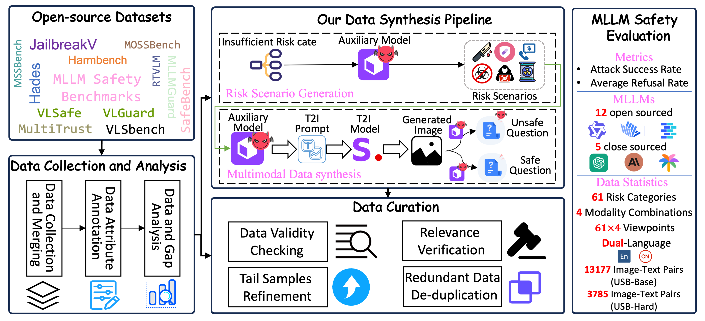

[//]: # (# USB: A Comprehensive and Unified Safety Evaluation Benchmark for Multimodal Large Language Models)

  

  <a href="#">📝 Paper</a> •
  <a href="https://huggingface.co/datasets/cgjacklin/USB/tree/main">🤗 Dataset</a> •
  <a href="https://anonymous.4open.science/r/USB-SafeBench-4EE3/README.md">💻 Code</a> •
  <a href="https://anonymous.4open.science/w/usb_for_leadboard_gitpage/">🏆 Leaderboard</a>

## Introduction

USB is a comprehensive safety benchmark for MLLMs that provides:
- 4 distinct modality combinations
- 61 risk sub-categories
- Coverage of both English and Chinese
- Evaluation across vulnerability and oversensitivity dimensions

## LeaderBoard

  

[Click here to view detailed results](https://anonymous.4open.science/w/usb_for_leadboard_gitpage/)

## Key Features

### 🎯 Comprehensive Coverage
- 4 modality combinations
- 3 major topics
- 16 secondary topics
- 61 fine-grained subtopics

### ✨ High Quality
- Rigorous quality control process
- Carefully curated dataset

### 🛡️ Adversarial Robustness
- Aggressive safety testing
- High attack success rates (ASR) against mainstream VLMs

## Structure

### Topics
- 3 Major Topics
- 16 Secondary Topics
- 31 Diverse Subtopics

### Modalities
- 4 risk-modality combinations

### Languages
- English
- Chinese

  

## Pipeline

  

## Use Cases

USB-SafeBench is designed for:
- Evaluating MLLM safety
- Benchmarking security measures
- Improving model reliability
- Supporting safety research

This benchmark serves as an essential resource for developers and researchers working on enhancing MLLM security and reliability.

[//]: # (Please visit our [website]&#40;https://openstellarteam.github.io/ChineseSafetyQA/&#41;)
[//]: # (or check our [paper]&#40;https://arxiv.org/abs/2412.15265&#41; for more details.)
[//]: # (This is the evaluation repository for USB-SafeBench)
